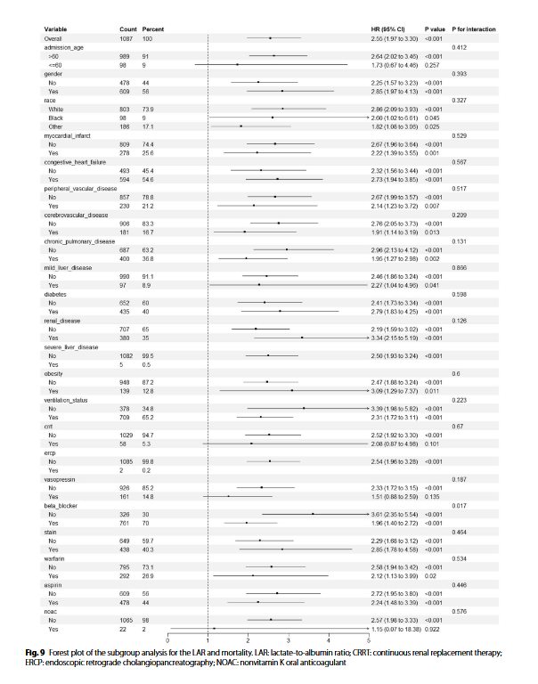

# 基线分析+单变量Cox+皮尔逊相关矩阵和多重共线性诊断+LASSO 回归+多变量Cox(两种不同混杂变量矫正)+RCS 的 Cox 比例危险模型+ROC+ROC阈值分组+分组后KM曲线+分组后亚组分析

### 基线分析

这些基线比较分析中显示出来有显著性差异的变量被纳入单因素cox回归进行进一步分析

### 单变量Cox

对基线特征中显示出显著统计学差异（P < 0.05）的变量进行了单变量 Cox 回归分析

分析结果显示，未经调整的 LAR 与 28 天死亡率之间存在密切联系（HR 1.79，95% CI 1.58-2.03，p < 0.001）

为减少潜在的过拟合，对单变量 Cox 模型中确定为重要的变量采用了 LASSO 回归

### 皮尔逊相关矩阵和多重共线性诊断

在进行LASSO 分析之前，通过皮尔逊相关矩阵和多重共线性诊断对共线性进行了评估，大多数协变量显示出可接受的共线性水平，方差膨胀因子（VIF）值小于 5，但也有少数协变量超过了这一阈值

### LASSO 回归

经过LASSO 回归，保留了 17 个系数不为零的变量进行进一步分析

### 多变量Cox(两种不同混杂变量矫正)

单变量分析和 LASSO 分析中 P **均小于 0.05** 的变量随后被纳入多变量 Cox 回归模型，其中额外加入混杂变量进行矫正，model1额外矫正年龄、性别，model2额外矫正年龄、性别、心率、呼吸频率、白细胞计数、LAR、阴离子间隙、BUN、血钾、PT、脑血管疾病、CCI、SOFA评分、机械通气、血管加压素的使用以及β受体阻滞剂、他汀类药物和华法林的使用，两个经过矫正的多变量COX模型中LAR仍然是一个独立的风险因素（模型II：HR 1.03，95% CI 1.01-1.06，P <0.05）

### RCS 的 Cox 比例危险模型

为了进一步描述 LAR 与死亡风险之间的关系，采用了包含 RCS 的 Cox 比例危险模型（图 6）。该模型显示出明显的线性关系（总体 p < 0.001），并有非线性证据（p = 0.003）。样条曲线显示了危害随剂量的增加而增加，当 LAR 临界值超过约 0.56 时，可观察到有临床意义的风险加速。这些发现强调了 LAR 作为一种连续性生物标志物的预后价值，在这种生物标志物中，高于生理标准（LAR > 0.56）的增量与死亡风险的增加独立相关，而不依赖于预定义的临界值

### ROC+ROC阈值分组

作者在这里构建ROC曲线，并没有使用一个特定的回归模型（如Cox或逻辑回归），而是直接使用了每个生物标记物本身的原始数值来对患者的最终结局（28天内死亡/存活）进行预测

在最佳尤登指数临界值（LAR = 0.605）时，在临床相关阈值 0.605 时对患者进行二分

### 分组后KM曲线

生存分析显示，高 LAR 组和低 LAR 组的 28 天死亡率存在显著差异（HR 2.55，95% CI 1.97-3.30）

### 亚组分析

以LAR分层，并进行亚组分析

